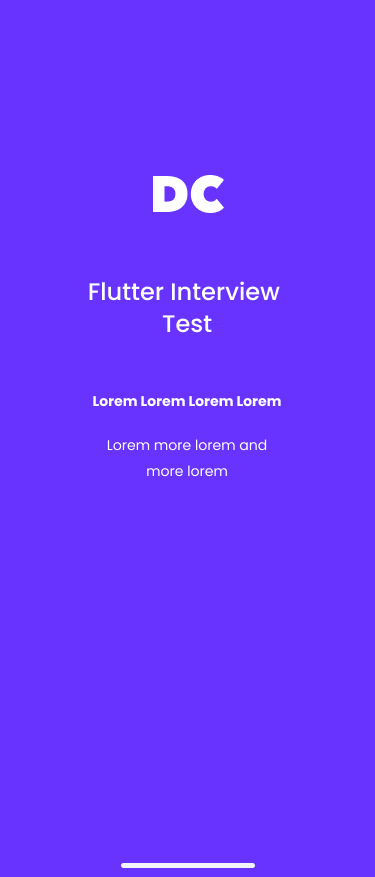
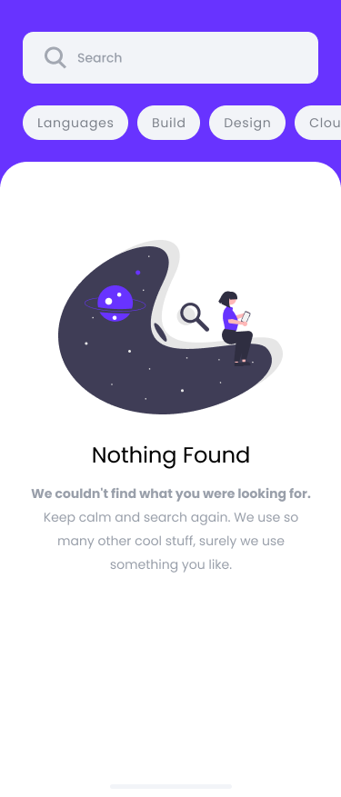
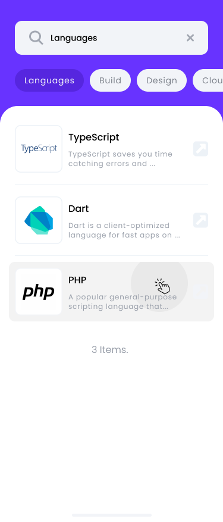
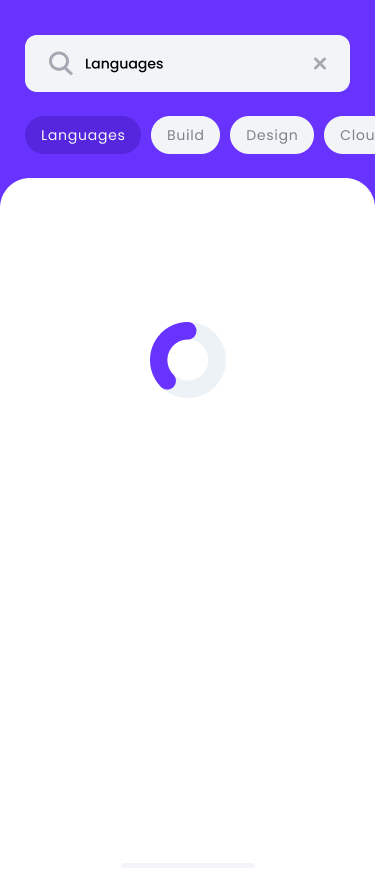
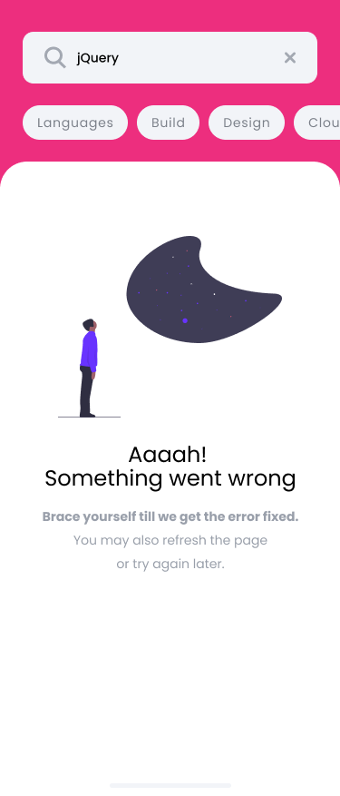
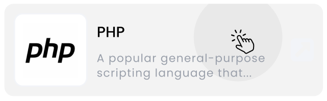
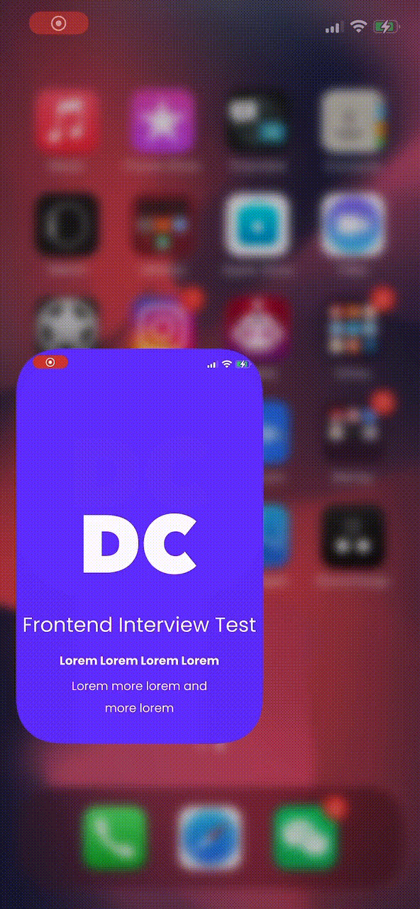
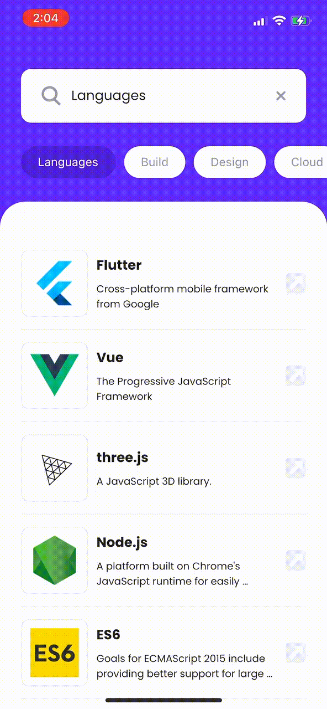

# Flutter Front-end Test - Building a Search Box Component

Versions in other languages: [中文](./README-ZH.md)

We want you to develop a search box component that has the function of searching for the programming tools we are using at DC. Let's get started!

## Materials

- The completed pages should strictly follow the design templates offered by us, which can be found here: [design templates on Figma](https://www.figma.com/file/mcHQ3hMUG0fmgWVh6QPUlv/Frontend-test-What-technologies-we-are-using-at-DC?node-id=1240%3A231). *You may need to create a free account to be able to inspect the elements precisely*.

- The data should be retrieved from the following API: [`GET -> https://frontend-test-api.digitalcreative.cn/?no-throttling=true&search=flutter`](https://frontend-test-api.digitalcreative.cn/?no-throttling=true&search=flutter)

- A launch/splash screen should be included, this will be seen when the application starts:
    
    

- A total of 4 different searching states of the search box should be included:

    - Successful request without any result: When the API responses, no result was found.

      

    - Successful request with results: When the API responses, the results are successfully found.

      
    
    - Pending request: When the request hasn't yet gotten a response.

      

    - Error while requesting: When the API is responding, an error or a timeout occurred.
    
        *Please note that you have to change the `no-throttling` parameter in the query string to `false` to make the API simulate this kind of situation.*

      

## Rules

- The application has to be developed using `Flutter`.

- Split your code into logical reusable components. We want to see how you isolate your components.

- You have to create at least 2 universal components, which are

  - Tag component

    

  - Result item component

    

- Here is our demands priority list, you can follow the priority indication to complete your work in limited time

  | Demands                                                      | Priorities |
  | ------------------------------------------------------------ | ---------- |
  | Achieve UI with high quality implementation                  | ⭐️⭐️⭐️        |
  | Achieve search function on search bar               | ⭐️⭐️⭐️        |
  | Achieve search triggering and content auto-fill function on tag component | ⭐️⭐️⭐️        |
  | Achieve result list browsing and evoking external website function | ⭐️⭐️⭐️        |
  | Handle the situation when search requests are failed or timeout | ⭐️⭐️⭐️        |
  | Achieve spinner animation when requesting result             | ⭐️⭐️         |
  | Add two-state transition animation                           | ⭐️          |
  | Add app icon                           | ⭐️          |

## What we will be looking for

- A nice architecture. Code should be written in a way that's easy to read and follow - a clear folder structure is very crucial as well.
- A good UI composition. We'll evaluate your work based on how you connected the components, how the data flows, how the states are managed within the application.
- Consistent and clean code.

## Bonus points

- Used Null Safety
- Used Static Typing (i.e. no use of `var`)
- Implemented pixel-perfect UI
- Incorporated list and tag animations
- Improved functions or UI/UX according to your own thoughts
- ...

## Final effects

- App launch (launch/splash screen)

  

- Normal usage

  

- Dealing with error

  

---

If you have any doubt, don't hesitate and send us an email (hello@digitalcreative.asia).

We can't wait to see what you come up with! Thanks for your time!